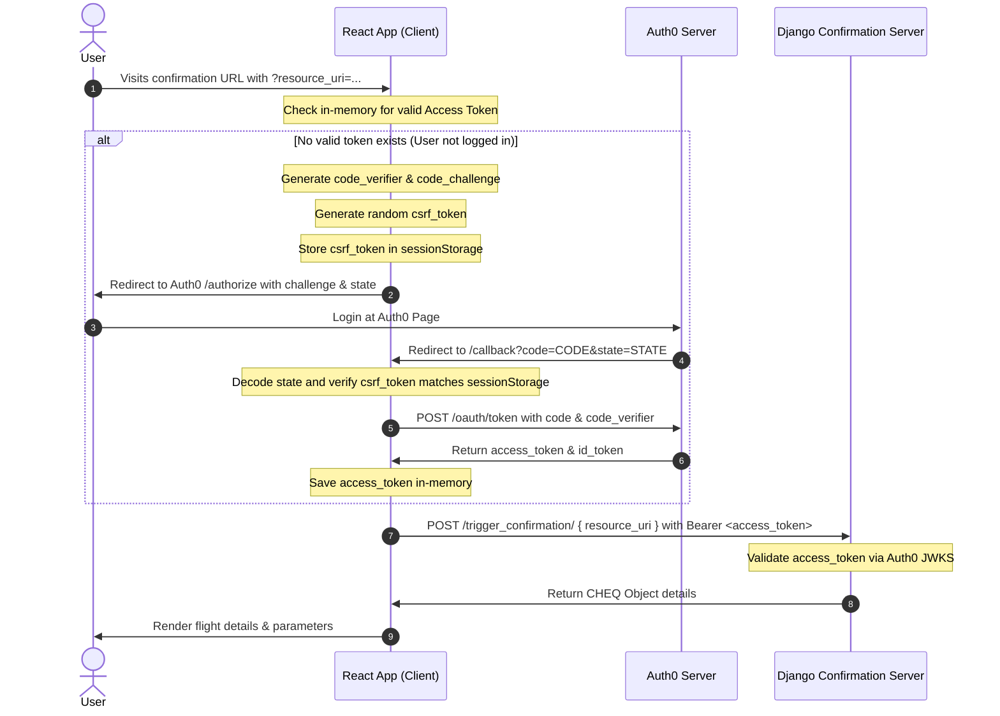

# User and Confirmation Server Authentication

This details how the user will get authenticated so that the confirmation server knows who is making the request.

According to the documentation, the user must log in first before they can confirm their flight information. This is done to ensure non-repudiation and also to achieve the main objective of CHEQ Sync: taking sensitive authorization out of the hands of AI agents.

We are going to implement this using **Auth0** as the identity provider using the **Authorization Code Flow with PKCE (Proof Key for Code Exchange)** grant type. This is the best implementation path because it eliminates the need for the confirmation server to store and maintain its own user credential registry.

---

## Auth0 Tenant Configuration

To implement this flow, configure the Auth0 tenant with the following settings:

- **Application Type**: Single Page Application (SPA)
- **Allowed Callback URLs**: `http://localhost:5173/callback` (Dev) / `https://your-app.com/callback` (Prod)
- **Allowed Logout URLs**: `http://localhost:5173` (Dev) / `https://your-app.com` (Prod)
- **Token Endpoint Authentication Method**: None (PKCE replaces client secrets for public clients)
- **Custom API Audience**: `https://cheq-confirmation-server` (Required to issue access tokens in JWT format rather than opaque strings)

---

## Step-by-Step Implementation Flow

### 1. Generating Verifier and Challenge (Client)
- The client generates a `code_verifier`: a cryptographically random string that is kept strictly in-memory.
- The client derives a `code_challenge`: a SHA-256 hash of the `code_verifier`, base64url-encoded. This can safely be exposed in the URL since a cryptographic hash is one-way (you cannot reverse it to get the verifier).

### 2. Redirect to Auth0 `/authorize`
The client redirects the user to the Auth0 authorize endpoint with the challenge attached:

```http
GET https://your-tenant.auth0.com/authorize?
  response_type=code
  &client_id=YOUR_CLIENT_ID
  &redirect_uri=http://localhost:5173/callback
  &code_challenge=YOUR_CODE_CHALLENGE
  &code_challenge_method=S256
  &state=YOUR_SECURE_STATE
```

### 3. User Login
The user authenticates at the Auth0 hosted login page.

### 4. Callback Redirect
Auth0 redirects back to the client's registered callback URL with a short-lived authorization code and the state parameter:

```http
GET http://localhost:5173/callback?code=AUTH_CODE_HERE&state=YOUR_SECURE_STATE
```

### 5. Exchanging Code for Tokens
The client extracts the auth code and sends a POST request to exchange it for tokens, sending the original in-memory `code_verifier`:

```http
POST https://your-tenant.auth0.com/oauth/token
Content-Type: application/json

{
  "grant_type": "authorization_code",
  "client_id": "YOUR_CLIENT_ID",
  "code": "AUTH_CODE_HERE",
  "code_verifier": "ORIGINAL_CODE_VERIFIER",
  "redirect_uri": "http://localhost:5173/callback"
}
```

Auth0 hashes the received `code_verifier` and verifies it matches the originally submitted `code_challenge`. If they match, Auth0 returns the `access_token` and `id_token`.

---

## Preserving Transaction State (Context Handover & CSRF Protection)

To ensure the user is returned to the exact confirmation request after logging in, while preventing Cross-Site Request Forgery (CSRF) attacks:

1. **State Construction**: Before redirecting to `/authorize`, the client captures the `resource_uri` from the incoming CHEQ URI pack and generates a cryptographically secure, random, single-use nonce (`csrf_token`).
2. **Local Storage**: The client stores the `csrf_token` in temporary storage (e.g., `sessionStorage`).
3. **Encoding**: The client constructs a JSON object containing both values, URL-encodes (or base64url-encodes) it, and passes it in the `state` parameter:
   ```json
   {
     "csrf": "d9812a02-2b81-4a11-b0e2-df08a12918bc",
     "resource_uri": "https://api.airline.com/confirmations/8asdjd8"
   }
   ```
   *Example parameter:* `&state=eyJjc3JmIjoiZDk4MTJhMDItMmI4MS00YTExLWIwZTItZGYwOGExMjkxOGJjIiwicmVzb3VyY2VfdXJpIjoiaHR0cHM6Ly9hcGkuYWlybGluZS5jb20vY29uZmlybWF0aW9ucy84YXNkamQ4In0=`
4. **Validation**: Upon callback redirection, the client decodes the `state` parameter, extracts the `csrf` value, and asserts that it matches the locally saved `csrf_token`. If they match, the request is validated.
5. **Redirection**: The client reads the validated `resource_uri`, decodes it, and proceeds to fetch the transaction details.

---

## Token Security & Storage

### Access Tokens
- **Storage**: Access tokens must be stored strictly in-memory. They should not be stored in `localStorage` or `sessionStorage` to mitigate Cross-Site Scripting (XSS) token theft.
- **Usage**: Sent as a Bearer token in the `Authorization` header when performing requests to the Confirmation Server.

### ID Token Validation & Verification
The Confirmation Server must validate the ID/Access Token signature and claims before displaying sensitive transaction details or signing the CHEQ payload:
1. **Signature Verification**: Retrieve the issuer public key from Auth0's JSON Web Key Set (JWKS) endpoint (`https://your-tenant.auth0.com/.well-known/jwks.json`) and verify the signature.
2. **Issuer (`iss`) Check**: Confirm the token issuer matches `https://your-tenant.auth0.com/`.
3. **Audience (`aud`) Check**: Confirm the audience claim matches the registered client/audience ID.
4. **Expiration (`exp`) Check**: Verify the current time is before the token expiration time.

---

## Complete Authentication Sequence


